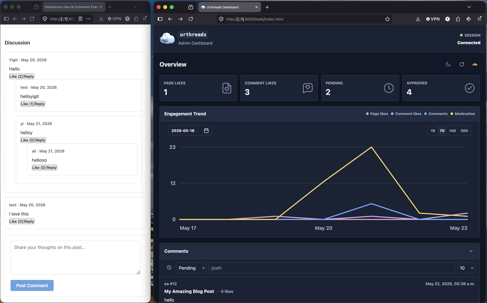

#  Urthreads

| *> Overview <* | [Dashboard](./web/DASHBOARD.md) | [Configuration And Environment](./config/CONFIGURATION_AND_ENVIRONMENT.md) | [Program Logic](./src/PROGRAM_LOGIC.md) | [Tests](./test/TESTS.md) |
| --- | --- | --- | --- | --- |

`urthreads` is self-hosted software for adding engagement features to static websites. Simply deploy the Worker to your own Cloudflare account, connect it to your own D1 database, and manage the dashboard with your own admin key.



It adds page likes, threaded comments, moderation, dashboard analytics, and admin tooling for blogs, portfolios, documentation sites, and other static pages that need interaction without running a traditional server.

### Before We Begin...

Special thanks to [lostinurarms1](https://www.deviantart.com/lostinurarms1) for the logo design. You can submit your own request from their Fiverr page to get a specialized logo!

## What It Does

- Tracks page likes by path.
- Stores comments and replies in Cloudflare D1.
- Keeps new comments pending until moderated.
- Supports denied keywords for automatic rejection.
- Provides a static admin dashboard for moderation, stats, posts, logs, and Worker metadata.
- Provides CLI tools for setup, environment management, admin keys, sessions, likes, comments, stats, and D1 health checks.
- Uses an `HttpOnly`, `Secure` admin session cookie for the dashboard after the admin key is submitted once.

## Quick Start

The recommended path is to use the published package CLI. It keeps setup boring in the best way: it uses Wrangler authentication when available, can create your D1 database for you, then writes a local `.env` and can create `wrangler.toml`.

```bash
npm install -g urthreads
wrangler login
urthreads setup-env
```

The guided setup can:

- use your local Wrangler login
- create a D1 database after asking what name you want, such as `your-threads`
- parse and write the D1 database ID
- optionally store Cloudflare account/API values for advanced workflows
- Worker name and Worker URL
- allowed browser origins
- maximum comments returned per post
- optionally initialize the D1 schema and deploy when you provide a workers.dev subdomain

It writes a local `.env` with restricted file permissions where your platform supports them.
It also updates `examples/urthreads-worker-config.js` so the static HTML examples point at the configured Worker, and offers to create `wrangler.toml` from the same answers. You can create it separately later with:

```bash
urthreads wrangler-init
```

Adjust Wrangler values without opening the file:

```bash
urthreads wrangler set account_id your-account-id
urthreads wrangler set database_id your-d1-database-id
urthreads wrangler set ALLOWED_ORIGINS https://example.com
```

Initialize the database schema and deploy:

```bash
wrangler d1 execute your-threads --remote --file=src/schema.sql
wrangler deploy
```

### Manual Repository Setup

If you download or clone the repository instead of using the published package, install dependencies and run the same setup command through npm:

```bash
npm install
npm run setup:env
```

The local npm script calls the same CLI flow as `urthreads setup-env`. You can also run the repo entrypoint directly:

```bash
node src/urthreads.js setup-env
```

## Website Usage

Configure the browser scripts with your Worker endpoints:

```html
<script>
  window.LIKES_CONFIG = {
    endpoint: "https://your-worker.workers.dev/likes"
  };
  window.COMMENTS_CONFIG = {
    endpoint: "https://your-worker.workers.dev/comments"
  };
</script>
<script src="/path/to/likes.js"></script>
<script src="/path/to/comments.js"></script>
```

Add a like button:

```html
<button data-like-button data-path="/blog/my-post">
  Like (<span data-like-count>0</span>)
</button>
```

Add a comments container:

```html
<div
  data-worker-comments
  data-page-id="/blog/my-post"
  data-page-url="https://example.com/blog/my-post"
  data-page-title="My Post"
>
  <div data-comment-list></div>
  <div data-comment-status></div>
  <form data-comment-draft-form>
    <textarea name="content" required></textarea>
    <button type="submit" data-comment-send>Post</button>
  </form>
</div>
```

Complete examples live in [examples](./examples).

For the static HTML examples, run `urthreads setup-env` or set `WORKER_URL` so `examples/urthreads-worker-config.js` points at your deployed Worker. You can also test a Worker without editing files by appending a query string:

```text
http://localhost:8000/examples/standalone-html/?worker=https://your-worker.workers.dev
```

If you serve examples from `http://localhost:8000` or `http://[::1]:8000`, add that exact origin to `ALLOWED_ORIGINS` and redeploy the Worker.

## Dashboard Usage

Generate an admin key:

```bash
urthreads admin-key
urthreads admin-session --ttl 1h
```

`urthreads admin-key` writes the key to `.env`, copies it to your clipboard, and can optionally store it with `wrangler secret put ADMIN_API_KEY`. If the key expires, it can also update `ADMIN_API_KEY_EXPIRES_AT` in `wrangler.toml` and prompt for deployment.

If you skip the automated expiration update, run the commands shown by the CLI:

```bash
urthreads wrangler set ADMIN_API_KEY_EXPIRES_AT "2026-06-01T02:26:56.380Z"
wrangler deploy
```

Copy dashboard values without printing them:

```bash
urthreads env copy-worker-url
urthreads env copy-admin-key
```

Open [web/index.html](./web/index.html), enter the Worker URL and admin key, and the dashboard will create a short-lived cookie session.

Important: dashboard refresh persistence requires the dashboard's exact browser origin in `ALLOWED_ORIGINS`. Do not use `*` for dashboard sessions.

### Host The Dashboard

For production, host the static dashboard under your own site, commonly at:

```text
https://www.myblog.com/urthreads/
```

The dashboard UI and Worker API stay separate:

```text
Dashboard UI: https://www.myblog.com/urthreads/
Worker API:   https://urthreads-worker.your-subdomain.workers.dev
```

Copy the contents of [web](./web) to the `/urthreads/` directory in your static site output. The dashboard files should be served so `index.html`, `dashboard.js`, and `styles.css` are available under that path.

Add the dashboard's origin to the Worker CORS allowlist. Origins do not include paths, so for `https://www.myblog.com/urthreads/` add:

```bash
urthreads env add-origin https://www.myblog.com
urthreads wrangler set ALLOWED_ORIGINS https://www.myblog.com
wrangler deploy
```

Then open `https://www.myblog.com/urthreads/` and enter your Worker API URL.

## Useful CLI Commands

```bash
urthreads setup-env                       # Create local .env interactively
urthreads wrangler-init                   # Create wrangler.toml interactively
urthreads wrangler set database_id d1-id  # Update wrangler.toml D1 ID
urthreads env add-origin https://example.com # Add an allowed browser origin
urthreads env copy-admin-key              # Copy admin key without printing it
urthreads env copy-worker-url             # Copy Worker URL for the dashboard
urthreads env copy D1_DATABASE_ID         # Copy setup values without printing them
urthreads env open                        # Open .env in a viewer
urthreads admin-key                       # Generate or rotate admin key
urthreads admin-session --ttl 1h          # Set dashboard session lifetime
urthreads clean --dry-run                 # Preview cleanup while keeping config/database
urthreads clean                           # Remove caches and working files
urthreads clean-all                       # Full local reset; can also delete Worker
urthreads delete-worker --name worker     # Delete Worker, optionally delete D1, then offer cleanup
urthreads pending                         # List pending comments
urthreads approve 5 --execute             # Approve comment 5
urthreads reject 5 --execute              # Reject comment 5
urthreads list-likes                      # List liked paths
urthreads stats                           # Show database stats
urthreads health                          # Run D1 health check
```

Most D1 management commands print the Wrangler command by default. Add `--execute` or `--run` to run it immediately.

## Back-Out Commands

Use these when you want to test setup from a clean local state before release.

```bash
urthreads clean --dry-run
urthreads clean
urthreads clean-all
urthreads clean-all --delete-worker
urthreads clean-all --delete-worker --delete-database
urthreads delete-worker --name urthreads-worker
urthreads delete-worker --name urthreads-worker --delete-database
```

Prefer `clean` for normal retesting: it removes caches and local working outputs while keeping your database and configuration files. Use `clean-all` when you want to start setup over: it removes caches, working files, `.env`, `wrangler.toml`, and `.dev.vars`, and asks whether to delete the deployed Worker first. If a Worker is being deleted, the CLI also asks whether to delete the inferred D1 database; pass `--delete-database` only when you intentionally want to remove stored likes, comments, and moderation data. `delete-worker` runs `wrangler delete` only after a warning and confirmation, then recommends removing local environment, cache, and working files that refer to the deleted Worker. Use `--keep-local` only when you intentionally want to retain local setup files.

The granular `clean-cache`, `clean-files`, and `clean-env` commands remain available for targeted cleanup, but the unified commands are the recommended release-test workflow.

## Development

Run tests:

```bash
npm test
```

Run local Worker development:

```bash
wrangler dev
```

Serve the dashboard locally:

```bash
python3 -m http.server 8000
```

Then open `http://localhost:8000/web/index.html` or `http://[::1]:8000/web/index.html`.

## Contributing

Contributions are welcome. Before opening a pull request, read [CONTRIBUTING.md](./CONTRIBUTING.md), keep changes focused, and run:

```bash
npm test
npm run check
```

Please do not report security vulnerabilities in public issues. Use the private reporting guidance in [SECURITY.md](./SECURITY.md).

## Upcoming Changes

- Optional Cloudflare Access or identity-provider setup notes for teams that want MFA in front of the dashboard.
- Widget-style Overview display: Add, arrange or remove overview statistics freely, giving users the freedom to display the specific data they choose to handle for their own uses.
- Comment approval settings (auto-approve comments, auto-detele rejected comments)
- Broader Worker integration tests for deployed or local Wrangler environments.
